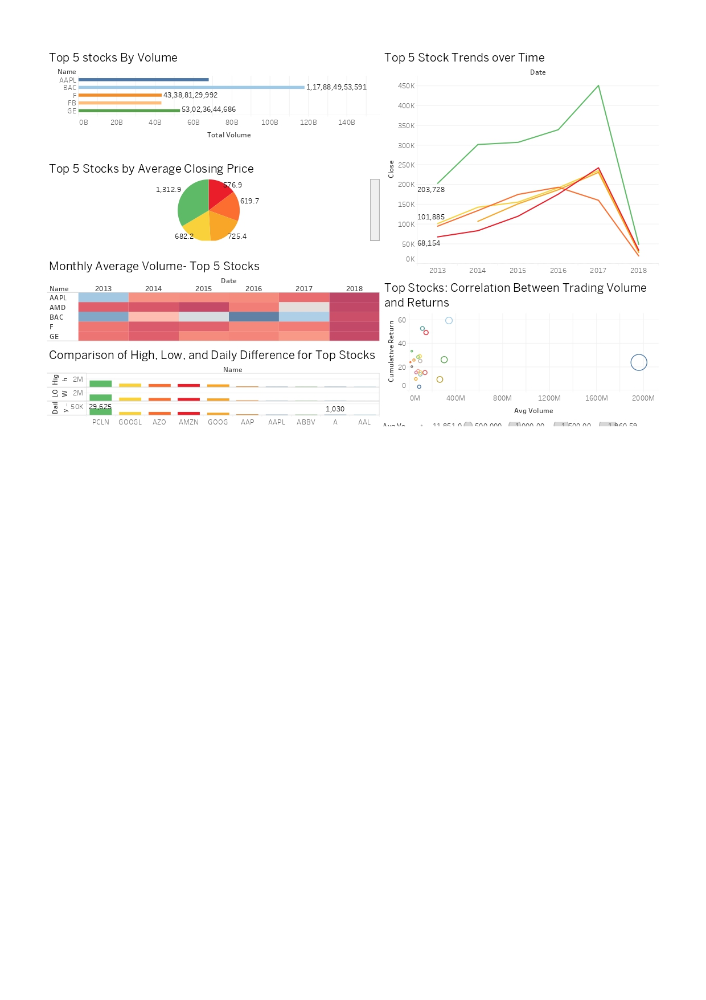

# My ETL Project with Tableau Dashboard

This project demonstrates an end-to-end ETL (Extract, Transform, Load) pipeline for processing stock market data. The project involves:
- Extracting and transforming raw data using Python.
- Loading the data into Snowflake for analysis.
- Visualizing insights using a Tableau dashboard.

## Tools and Technologies Used
- **Python**: For extracting, transforming, and cleaning the dataset.
- **Snowflake**: For data storage and SQL-based data modeling.
- **Tableau**: For creating interactive data visualizations.
- **GitHub**: For version control and project hosting.

## How to Run the Project
Follow these steps to set up and run the project:

### Step 1: Set Up the Environment
1. Install Python 3.x and the required libraries:
   ```bash
   pip install pandas numpy

### Step 2: Execute the ETL Pipeline
1. Extract and Transform Data:

Run the Python script located in the /etl folder:
bash
Copy code
python etl/etl_process.py
This will process the raw dataset and create a cleaned dataset in the /data folder

2. Load Data into Snowflake:

Execute the SQL scripts in the /snowflake folder in the following order:
create_tables.sql: Creates necessary tables.
data_modeling.sql: Models the data for analysis.

### Step 3: Visualize Insights in Tableau
Import the processed data into Tableau.
Open the Tableau dashboard

### Dashboard Overview
The Tableau dashboard provides:

Monthly average stock volumes.
Top 5 stocks with the highest cumulative returns.
Daily high-low differences for better insights.

### Dashboard Overview
The Tableau dashboard provides:

Monthly average stock volumes.
Top 5 stocks with the highest cumulative returns.
Daily high-low differences for better insights.

## Screenshots
### Tableau Dashboard



### Acknowledgments
Snowflake for providing a powerful cloud-based database solution.
Tableau for enabling easy and interactive visualizations.
Pandas and NumPy libraries for efficient data manipulation.
